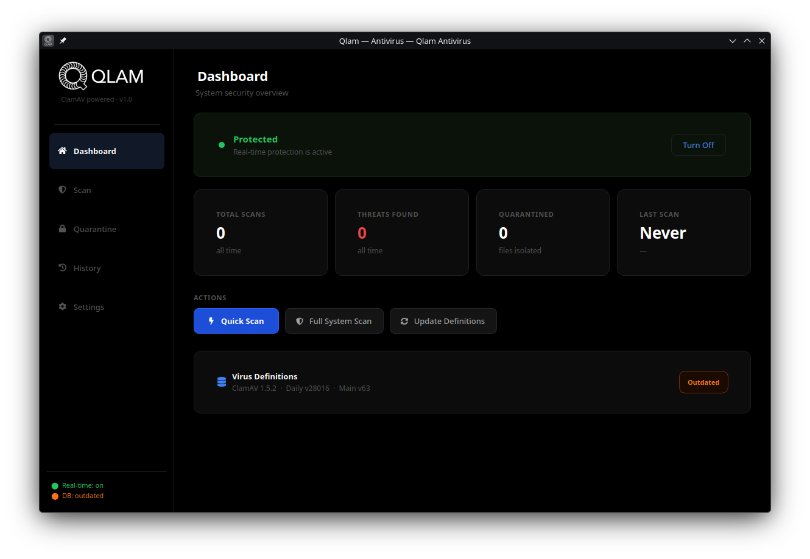

<div align="center">


<br/>

**A modern, open-source antivirus application powered by ClamAV**

[](https://python.org)
[](https://pypi.org/project/PyQt6/)
[](https://clamav.net)
[](LICENSE)
[](https://kernel.org)

</div>

---



---

## Features

- **Quick / Full / Custom Scan** — scan specific folders or the entire filesystem
- **Real-time Protection** — monitors watched directories using `watchdog`
- **Quarantine Manager** — isolate, restore or permanently delete threats
- **Scan History** — full log of past scans with threat details
- **Virus Database Updates** — one-click `freshclam` update via PolicyKit (no terminal needed)
- **OLED Dark Theme** — true black UI optimized for OLED displays
- **System Tray** — runs in the background, notifies on threat detection

## Requirements

| Dependency | Version |
|---|---|
| Python | 3.10+ |
| PyQt6 | 6.x |
| ClamAV | 1.x |
| polkit (pkexec) | any |

## Installation

### One-line install

```bash
git clone https://github.com/berkkucukk/Qlam.git
cd Qlam
./install.sh
```
```bash
paru -S qlam
yay -S qlam
```

The installer will:
1. Install system packages (`clamav`, `polkit`) via your distro's package manager
2. Create a Python virtual environment at `~/.local/share/Qlam/venv`
3. Install Python dependencies (`PyQt6`, `pyclamd`, `watchdog`, `qtawesome`)
4. Create a launcher at `~/.local/bin/qlam`
5. Add a `.desktop` entry to your application launcher

### Supported distros

| Distro | Package manager |
|---|---|
| Arch Linux / Manjaro | `pacman` |
| Ubuntu / Debian / Mint | `apt` |
| Fedora / RHEL / CentOS | `dnf` |
| openSUSE | `zypper` |

### Run after install

```bash
qlam
```

Or find **Qlam** in your application launcher.

### Uninstall

```bash
./uninstall.sh
```

## Running from source

```bash
git clone https://github.com/berkkucukk/Qlam.git
cd Qlam
python3 -m venv venv
source venv/bin/activate
pip install PyQt6 pyclamd watchdog qtawesome
python main.py
```

## Project Structure

```
Qlam/
├── main.py                  # Entry point
├── core/
│   ├── scan_engine.py       # ClamAV scanning (pyclamd + clamscan fallback)
│   ├── database_manager.py  # freshclam database updates
│   ├── quarantine_manager.py
│   ├── history_manager.py
│   └── realtime_protection.py
├── ui/
│   ├── main_window.py       # Main window + sidebar navigation
│   ├── dashboard_page.py
│   ├── scan_page.py
│   ├── quarantine_page.py
│   ├── history_page.py
│   └── settings_page.py
├── resources/
│   └── style.qss            # OLED dark theme stylesheet
├── Logos/
├── Screenshots/
├── install.sh
└── uninstall.sh
```

## How database updates work

Qlam uses `pkexec` (PolicyKit) to run `freshclam` with elevated privileges. When you click **Update Now**, your desktop environment's native authentication dialog appears — no password is stored by Qlam.

The update flow:
1. Stop `clamav-freshclam.service` (releases the log file lock)
2. Run `freshclam --verbose --stdout`
3. Restart `clamav-freshclam.service`

## License

MIT — see [LICENSE](LICENSE) for details.
