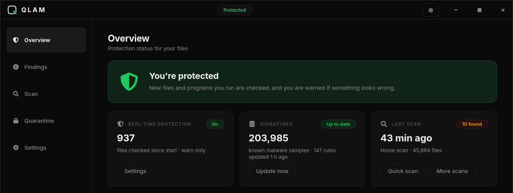

<div align="center">


<br/>

**A warn-first antivirus for the Linux desktop**

[](qlamd)
[](ui)
[](#license)
[](https://kernel.org)

</div>

---



---

Qlam watches the places a normal user can write to — your home folder,
`/tmp`, `/dev/shm`, USB drives — and tells you when something there looks
like malware. It is built around a few rules:

- **It warns; you decide.** Qlam never deletes anything on its own and, by
  default, never blocks or moves a file either. Every finding comes with a
  plain explanation and two choices: move it to quarantine, or trust it.
- **False alarms are bugs.** Detection sources and rules are chosen for
  precision, and when a rule is fixed, the findings it raised are withdrawn
  automatically.
- **It must never get in the way.** No program ever waits for Qlam, scans run
  at idle priority, and the service's CPU, disk and memory use is capped.
- **Protection doesn't depend on the window.** Scanning happens in a system
  service; the app only shows what it found.

Qlam is not a replacement for a commercial antivirus with a malware lab
behind it. It is a careful, open-source guard for the files users actually
download and run.

## Features

- **Real-time protection** — new and changed files in watched locations, and
  every program run from them, are checked in the background (fanotify).
- **On-demand scans** — quick (downloads, desktop, startup entries, temporary
  folders), whole home folder, or any folder you pick.
- **Startup checks** — autostart entries, systemd user units, shell startup
  files, crontabs and `LD_PRELOAD` settings are checked for the ways malware
  keeps itself running.
- **Findings with explanations** — what was found, how sure Qlam is, and what
  it means; notifications with a *Move to quarantine* button.
- **Safe quarantine** — files are stored encoded (they can't run), moved only
  once an intact copy exists, and restored after a full integrity check.
- **Self-correcting** — findings about files that no longer exist, or that
  current signatures no longer flag, close themselves.
- **Optional blocking** — known malware (an exact match with a known sample)
  can also be stopped from running; off by default.
- **Tray icon** — the tail of the Q shows the state: mint protected, red
  findings to review, amber protection off, grey service not running.
- **OLED design** — true-black interface with its own title bar; a light
  theme too.

## How detection works

| Engine | What it finds | Acts on its own? |
|---|---|---|
| Known-sample list | Files identical (SHA-256) to malware samples from [MalwareBazaar](https://bazaar.abuse.ch) — Linux file types only, and only samples attributed to a known family | Can block execution, if you enable it |
| Qlam rules (YARA) | Linux miners, botnets, rootkits, droppers, reverse shells, webshells | No — warnings only |
| YARA Forge rules | Community rules for Linux executables ([YARA Forge](https://github.com/YARAHQ/yara-forge)), counted only on ELF files | No — warnings only |
| ClamAV (optional) | ClamAV signatures, through a running `clamav-daemon` | No — warnings only |

Guards against false alarms:

- A hash match is ignored for files that pip installed (checked against the
  package's `RECORD`), and for hashes on Qlam's known-good list: malware
  feeds sometimes list legitimate libraries captured next to a bot.
- Rule sets are filtered: dual-use tools (socat, nmap), "suspicious"
  indicators, EICAR text rules and rules that match any text are left out.
  Script rules only apply to real scripts (`#!`).
- A safety brake pauses automatic actions if they suddenly spike, which is
  what a faulty signature update would look like.

Signatures are refreshed daily by `qlam-update.service`, which runs as an
unprivileged user in a sandbox.

## Architecture

```
 qlam (PyQt6 app, per user)               qlam-update.timer → qlam-update.service
   window · tray · notifications            user "qlam", sandboxed; writes
          │  D-Bus: org.maze.Qlam1          /var/lib/qlam/feeds only
          ▼  (polkit for changes)                     │
 qlamd (Rust, system service, root) ◄──── reloads ───┘
   fanotify notifications · yara-x · hash list · optional clamd
   quarantine + SQLite in /var/lib/qlam
```

- **qlamd** needs root for fanotify and to read and quarantine files in every
  user's home. It is sandboxed by systemd (read-only system, capability
  bounding set, no network) and limited to CPUWeight=20, IOWeight=20 and
  768 MB of memory; under memory pressure it goes before your programs.
- **The app** talks to it over D-Bus. Reading is limited to your own files
  and findings; every change goes through polkit (see below). Broadcast
  signals carry ids only, never file paths.

Typical footprint: about 40 MB of memory for signatures; background scans
only read files that can run (executables, scripts, packages) and use the
disk only when nothing else does.

## Installation

### From the Maze repository

**On Maze Linux** the repository is already configured:

```bash
sudo pacman -S qlam
```

**On Arch Linux and Arch-based distributions**, add the repository once:

1. Import and trust the Maze signing key:

   ```bash
   curl -O https://mazerepo.berkkucukk.com.tr/packages/mazelinux.gpg
   gpg --show-keys --with-fingerprint mazelinux.gpg
   sudo pacman-key --add mazelinux.gpg
   sudo pacman-key --lsign-key 7C4D515A6B930CB04794CEF6147C8159B3E2EE5F
   ```

   The fingerprint `gpg` prints must be `7C4D 515A 6B93 0CB0 4794  CEF6 147C 8159 B3E2 EE5F`.

2. Add the repository to the end of `/etc/pacman.conf`:

   ```ini
   [mazelinux]
   SigLevel = Required DatabaseOptional
   Server = https://mazerepo.berkkucukk.com.tr/packages
   ```

3. Sync and install:

   ```bash
   sudo pacman -Syu qlam
   ```

Optionally install `mazelinux-keyring` as well; it keeps the signing key up to date through pacman.

### Turn protection on

```bash
sudo systemctl enable --now qlamd.service qlam-update.timer
sudo systemctl start qlam-update.service   # first signature download, a few minutes
```

Then open **Qlam** from your application launcher (or run `qlam`). The tray
icon starts automatically at your next login.

For the optional ClamAV engine: `sudo pacman -S clamav` and
`sudo systemctl enable --now clamav-daemon` (it uses about 1 GB of memory).

### Remove

```bash
sudo pacman -Rns qlam
```

Quarantine, history and signatures stay in `/var/lib/qlam`; delete it by hand
if you no longer need them.

## Configuration

Most settings are in the app (**Settings**). System-wide defaults live in
`/etc/qlam/qlamd.toml`:

| Key | Default | Meaning |
|---|---|---|
| `realtime` | `true` | Scan files as they are written and run |
| `block_exec` | `false` | Also stop *known* malware (exact hash match) from running. Makes every program start on watched disks wait for Qlam |
| `auto_quarantine` | `false` | Move known malware to quarantine without asking |
| `max_file_size_mb` | `50` | Larger files are not scanned on access |
| `scope` | `/home`, `/root`, `/tmp`, `/var/tmp`, `/dev/shm`, `/run/user`, `/run/media`, `/media`, `/mnt` | Watched locations |
| `exclude` | `/var/lib/qlam` | Path prefixes never scanned on access |

Actions that change something ask polkit:

| Action | Default for the logged-in user |
|---|---|
| Scan your own files, update signatures, quarantine or delete your own findings | Allowed |
| Restore from quarantine, trust a file | Your own password |
| Scan other users' folders, change protection settings | Administrator password |

## Building from source

The package is built from the working tree by `build-pkg.sh`, exactly like the published one:

```bash
sudo pacman -S --needed base-devel git cargo
git clone https://github.com/berk-kucuk/QLAM.git
cd QLAM
./build-pkg.sh            # package in dist-pkg/
./build-pkg.sh --install  # build and install with pacman
```

`maze-python` (the shared Python runtime) comes from the Maze repository, so add the repository first.

## Development

```bash
cd qlamd
cargo test                  # unit tests
cargo clippy --all-targets

# A development daemon as your own user, on the session bus: no root, no
# real-time protection, no polkit. Point it at scratch state and at the
# rules in the tree:
QLAM_STATE_DIR=/tmp/qlam-dev QLAM_RULES_DIR=$PWD/rules \
  cargo run --release -- daemon --session

# In another terminal, the app against it (PyQt6 and qtawesome come
# with maze-python):
/opt/maze/venv/bin/python3 ../main.py --session

# Scan paths and print findings, without acting on anything:
cargo run --release -- scan ~/Downloads
```

`QLAM_FEEDS_DIR` points the daemon at another signature directory
(`/var/lib/qlam/feeds` is world-readable). The real-time stress test needs
root, since it uses fanotify: `sudo -E cargo test --release -- --ignored`.

The logo set is generated from geometry: `python3 tools/make_logo.py`.

## Project structure

```
Qlam/
├── main.py                 # app entry point (window, tray, single instance)
├── ui/                     # PyQt6 app: pages, D-Bus client, theme, brand
├── qlamd/                  # the daemon (Rust)
│   ├── src/
│   │   ├── realtime.rs     # fanotify on-access scanning
│   │   ├── scanner.rs      # on-demand scans
│   │   ├── guard.rs        # what happens after a detection
│   │   ├── quarantine.rs   # all-or-nothing, encoded quarantine
│   │   ├── persistence.rs  # startup-entry checks
│   │   ├── dbus.rs         # org.maze.Qlam1 API + polkit
│   │   ├── updater.rs      # signature feeds (qlam-update)
│   │   └── engine/         # hash list, YARA, ClamAV, known-good checks
│   ├── rules/              # Qlam's own YARA rules and known-good list
│   └── dist/               # systemd, D-Bus, polkit, sysusers, tmpfiles, config
├── packaging/              # PKGBUILD and install script
├── tools/make_logo.py      # logo generator
├── Logos/                  # generated logo set
└── build-pkg.sh
```

## License

MIT.
