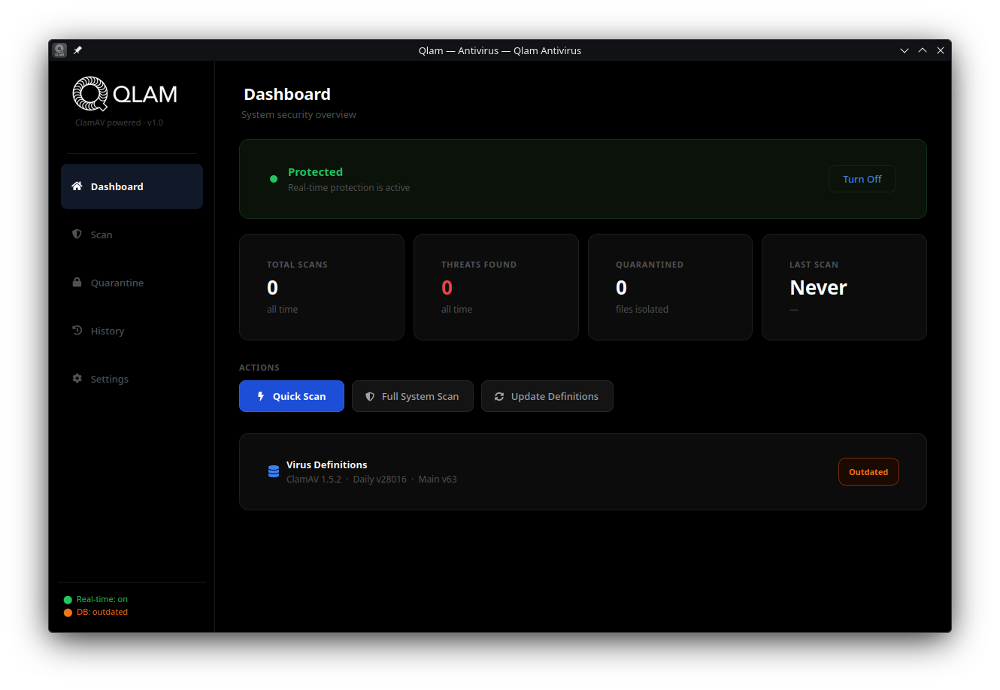

<div align="center">


<br/>

**A modern, open-source antivirus application powered by ClamAV**

[](https://python.org)
[](https://pypi.org/project/PyQt6/)
[](https://clamav.net)
[](LICENSE)
[](https://kernel.org)

</div>

---



---

## Features

- **Quick / Full / Custom Scan** — scan specific folders or the entire filesystem
- **Real-time Protection** — monitors watched directories using `watchdog`
- **Quarantine Manager** — isolate, restore or permanently delete threats
- **Scan History** — full log of past scans with threat details
- **Virus Database Updates** — one-click `freshclam` update via PolicyKit (no terminal needed)
- **OLED Dark Theme** — true black UI optimized for OLED displays
- **System Tray** — runs in the background, notifies on threat detection

## Requirements

| Dependency | Version |
|---|---|
| Python | 3.10+ |
| PyQt6 | 6.x |
| ClamAV | 1.x |
| polkit (pkexec) | any |

## Installation

### From the Maze repository

**On Maze Linux** the repository is already configured:

```bash
sudo pacman -S qlam
```

**On Arch Linux and Arch-based distributions**, add the repository once:

1. Import and trust the Maze signing key:

   ```bash
   curl -O https://mazerepo.berkkucukk.com.tr/packages/mazelinux.gpg
   gpg --show-keys --with-fingerprint mazelinux.gpg
   sudo pacman-key --add mazelinux.gpg
   sudo pacman-key --lsign-key 7C4D515A6B930CB04794CEF6147C8159B3E2EE5F
   ```

   The fingerprint `gpg` prints must be `7C4D 515A 6B93 0CB0 4794  CEF6 147C 8159 B3E2 EE5F`.

2. Add the repository to the end of `/etc/pacman.conf`:

   ```ini
   [mazelinux]
   SigLevel = Required DatabaseOptional
   Server = https://mazerepo.berkkucukk.com.tr/packages
   ```

3. Sync and install:

   ```bash
   sudo pacman -Syu qlam
   ```

Optionally install `mazelinux-keyring` as well; it keeps the signing key up to date through pacman.

Remove with `sudo pacman -Rns qlam`.

Then run `qlam`, or find **Qlam** in your application launcher.

### Build from source

The package is built from this working tree by `build-pkg.sh` and installed with pacman, exactly like the published one:

```bash
sudo pacman -S --needed base-devel git
git clone https://github.com/berk-kucuk/QLAM.git
cd QLAM
sudo pacman -S --needed $(bash -c 'source packaging/PKGBUILD; echo "${depends[@]}" "${makedepends[@]}"')
./build-pkg.sh --install
```

Without `--install` the package is only built, into `dist-pkg/`.

`maze-python` (the shared Python runtime) comes from the Maze repository, so add the repository first (steps 1–2 above).

## Development

Run straight from a checkout in a virtual environment:

```bash
python3 -m venv venv
source venv/bin/activate
pip install PyQt6 pyclamd watchdog qtawesome
python main.py
```

## Project Structure

```
Qlam/
├── main.py                  # Entry point
├── core/
│   ├── scan_engine.py       # ClamAV scanning (pyclamd + clamscan fallback)
│   ├── database_manager.py  # freshclam database updates
│   ├── quarantine_manager.py
│   ├── history_manager.py
│   └── realtime_protection.py
├── ui/
│   ├── main_window.py       # Frameless window + custom title bar + sidebar
│   ├── theme.py             # Monochrome dark/light theme system
│   ├── dashboard_page.py
│   ├── scan_page.py
│   ├── quarantine_page.py
│   ├── history_page.py
│   ├── settings_page.py
│   └── sudo_dialog.py
├── resources/
│   ├── check_dark.svg       # Theme-aware checkbox marks
│   ├── check_light.svg
│   ├── arrow_up.png
│   └── arrow_down.png
├── Logos/
├── Screenshots/
├── install.sh
└── uninstall.sh
```

## How database updates work

Qlam uses `pkexec` (PolicyKit) to run `freshclam` with elevated privileges. When you click **Update Now**, your desktop environment's native authentication dialog appears — no password is stored by Qlam.

The update flow:
1. Stop `clamav-freshclam.service` (releases the log file lock)
2. Run `freshclam --verbose --stdout`
3. Restart `clamav-freshclam.service`

## License

MIT — see [LICENSE](LICENSE) for details.
